# 目次

- [はじめに](#はじめに)
- [１解像度を上げる4つの視点](#１解像度を上げる4つの視点)
- [２あなたの今の解像度を診断しよう](#２あなたの今の解像度を診断しよう)
- [３まず行動する・粘り強く取り組む・型を意識する](#３まず行動する・粘り強く取り組む・型を意識する)
- [４課題の解像度を上げるー「深さ」](#４課題の解像度を上げる)
- [５課題の解像度を上げるー「広さ」「構造」「時間」](#５課題の解像度を上げる)
- [６課題の解像度を上げるー「深さ」「広さ」「構造」「時間」](#６課題の解像度を上げる)
- [７実験して検証する](#７実験して検証する)
- [８未来の解像度を上げる](#８未来の解像度を上げる)

# はじめに

- 解像度が低い状態とはどういう状態か

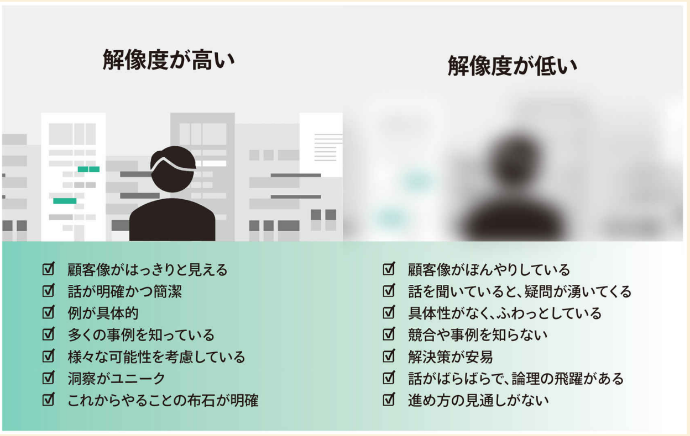

# １解像度を上げる4つの視点

- 解像度を上げるための4つの視点
    - 深さ
    - 広さ
    - 構造
    - 時間

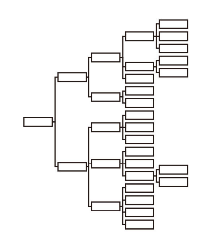

- 解像度が低い状態
    - 物事への理解が足りていないように見える
    - 議論がふわっとしていて地に足がついていない
    - 具体的な数字などを挙げられず，説得力が弱い
    - 抽象論だけで，具体例が挙げられない

- 図の横が深さ，縦が広さ．構造とは，ノード間の関係性．時間とは，時間変化によるノードの状態変化の把握

- 何から手をつければいいかわからないなら「深さ」から取りかかるのがいいらしい

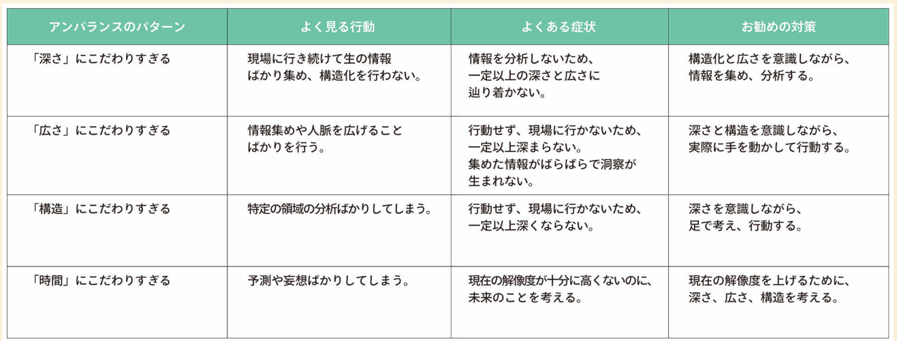

# ２あなたの今の解像度を診断しよう

- 解像度が低いと
    - 分からないところが分からない
    - 疑問がない，質問ができない

- アイデアや提案について以下の文章を埋められるか
    - {状況}という状況で, {課題}という課題をもつ, {対象顧客}向けの{製品/サービスジャンル}です．これには{利点}という利点があります．{既存の代替品・競合}とは違い{差別化要素}が備わっています．

- 解像度を高めるには
    - 深さ
        - 木が浅いと抽象度の高い議論になりがち
        - 「それはそう」としかならない
    - 広さ
        - 幅広い選択肢の提示ができるか
    - 構造
        - ノード間の関係性を明確にすることで話の筋が通る
        - そのノード間の関係性の上でクリティカルなものを提案する必要がある
    - 時間
        - そもそもその目標は短期的なのか長期的なのか
        - 時間変化に伴い木の構造が変化しないか

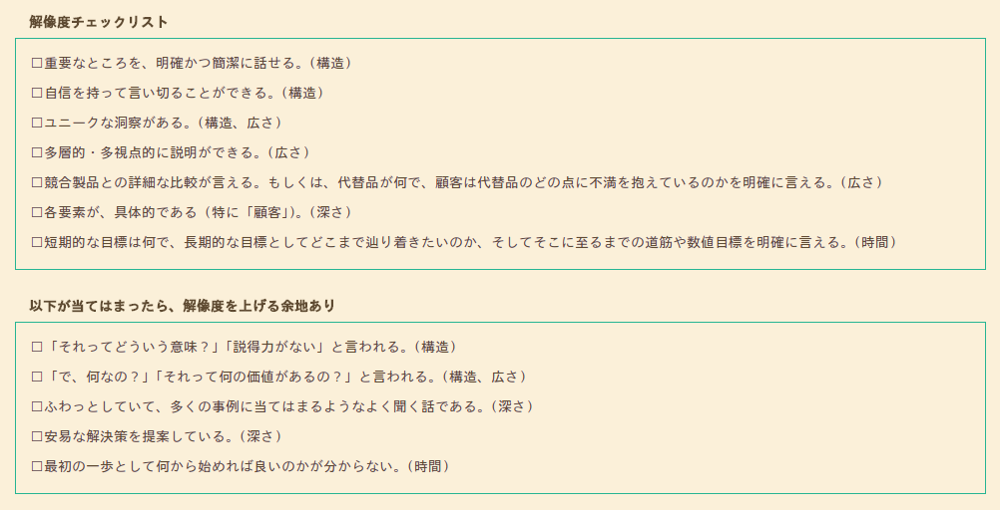

# ３まず行動する・粘り強く取り組む・型を意識する

- 行動と粘り強さは言わずもがな
- MVP(Minimum Viable Product)を意識する
  - 最低限機能するものを作り，それをユーザーに使ってもらい，ユーザーからのフィードバックを経て学びを得るサイクル
  - MVPを作ってから，行動し，解像度を上げていく
  - **アナリスト的視点でいうと，フィードバックを得るための最小限の集計や可視化をいかに早く渡せるかがキモなのかも**

- 型については4~6章で見ていく

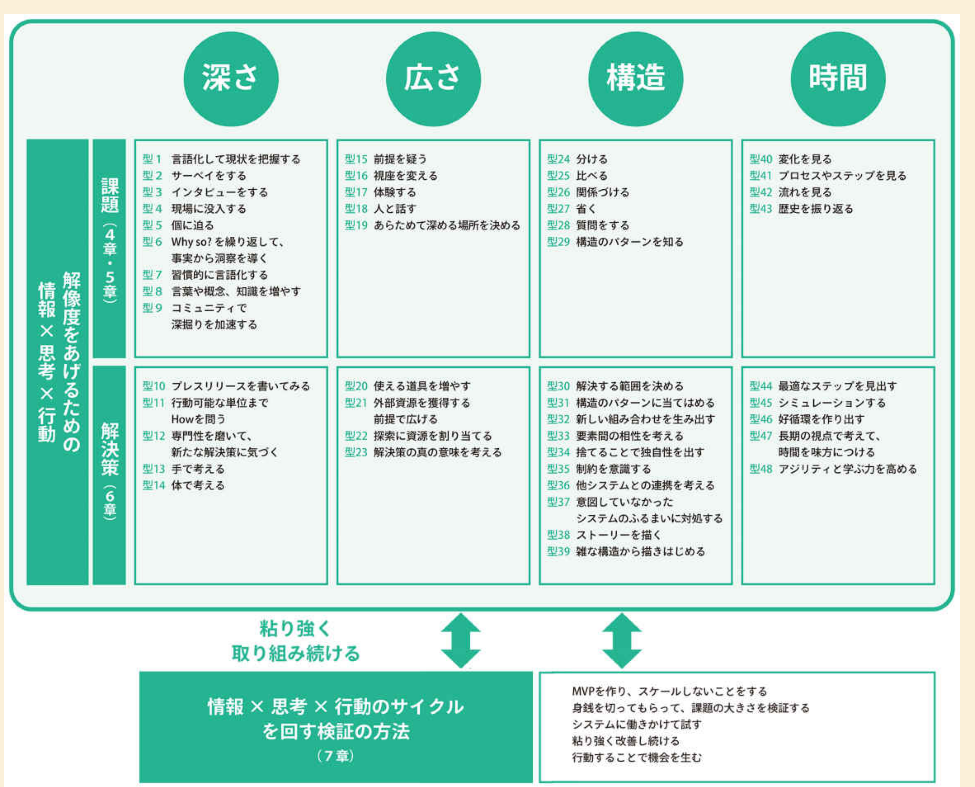

# ４課題の解像度を上げる

- 良い課題とは何か
  - 課題以上の価値は生まれない

- 良い課題の条件
  - 大きな課題である
    - 課題の大きさ = 課題の強度 x 課題の頻度
  - 合理的なコストで，現在解決し得る問題である
  - 実績をつくれる小さな課題に分けられる

- 深さを上げるための方法

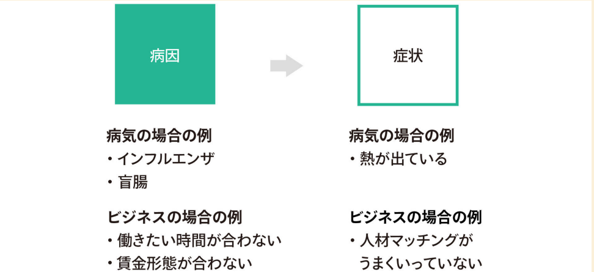

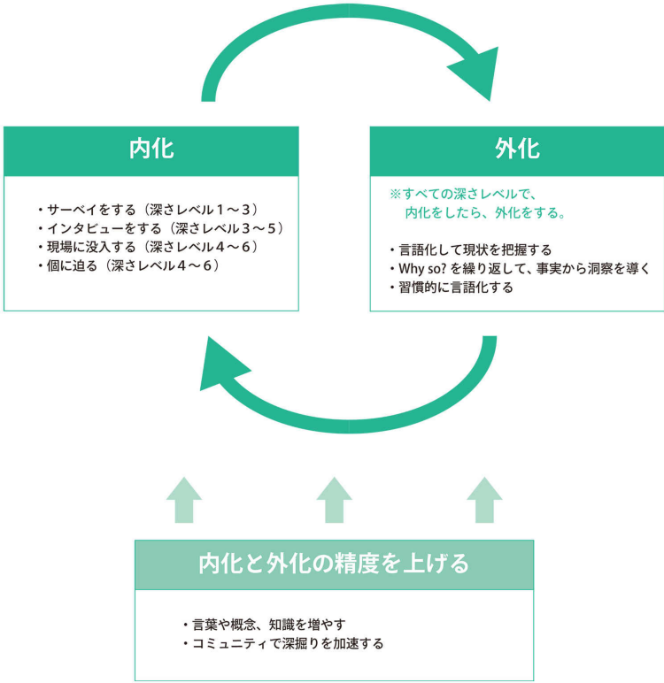

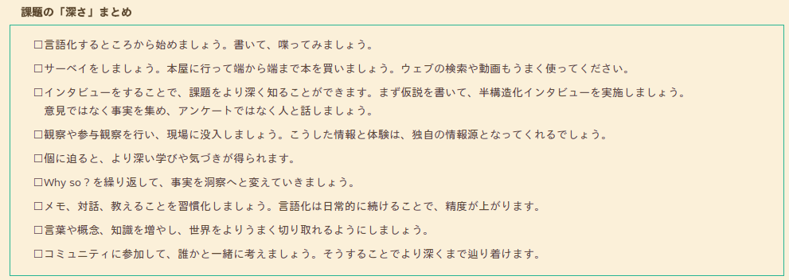

# ５課題の解像度を上げる

- 広さを上げるための方法
  - 10ｘの問
    - 今の10倍～するためにはどうしたら良い？を考える
  - リフレーミング
    - 物事を異なるフレームで見る
  - 視座を変える
    - 上司の成功は何かを考える
    - 視座の高い人と話す
  - レンズの使い分け
    - 物理学的，社会学的，など
  - 視座の行き来
    - マクロとミクロ
    - ユーザーと市場
    - 未来と現在
    - ビジネス・物理・社会

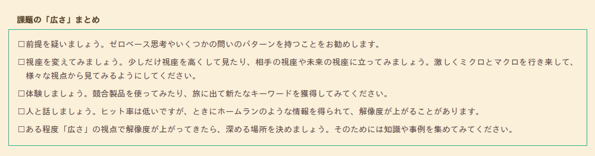

- 構造の視点
  - 分ける
    - MECEに分ける
    - あまりフレームワークには頼らず，独自の切り口を見つける工夫をする
    - 目的にあった最適な粒度で分ける
      - そのためには解決先や技術の知識も必要となる
  - 比べる
    - 分けたあとは，比較
    - 木の同一の階層では抽象度を揃える(まあそれが階層なんだけども..)
    - 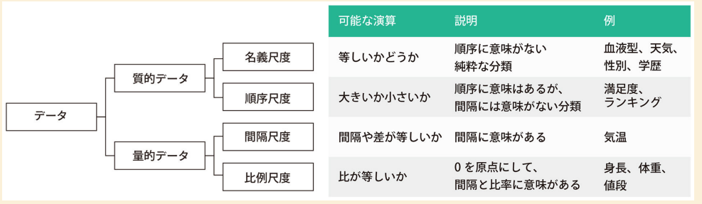
  - 関係づける
    - 可視化
    - アナロジー
  - 省く
    - 外れ値を省く

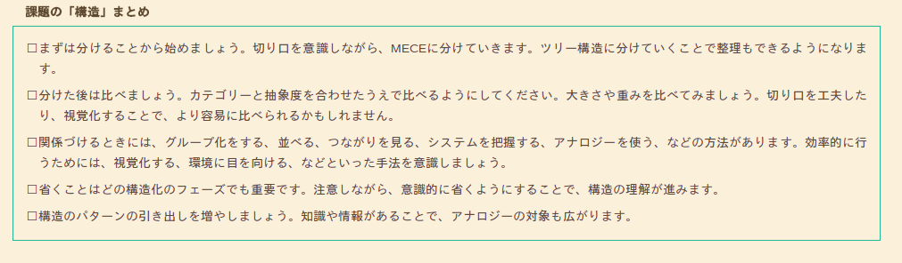

- 時間の視点

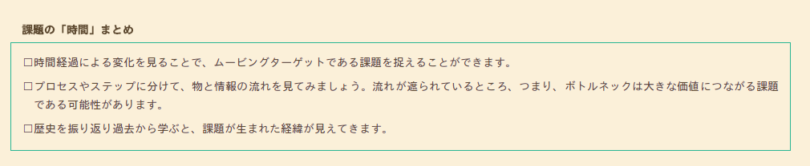

# ６課題の解像度を上げる

- 前章までは課題に付いての話，本章は解決策の話
- 良い解決策とは
  - 課題を十分に解決する
  - 合理的なコストで，現在実現し得る
  - 他の解決策に比べて優れている

# ７実験して検証する

# ８未来の解像度を上げる